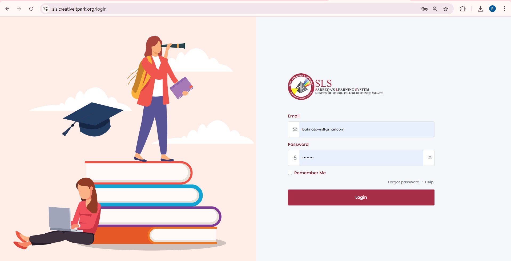
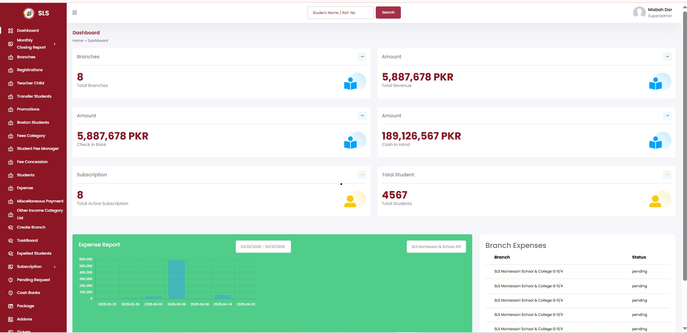
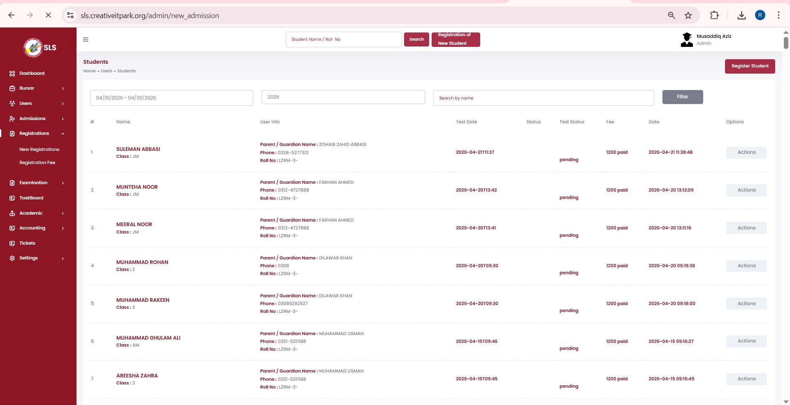
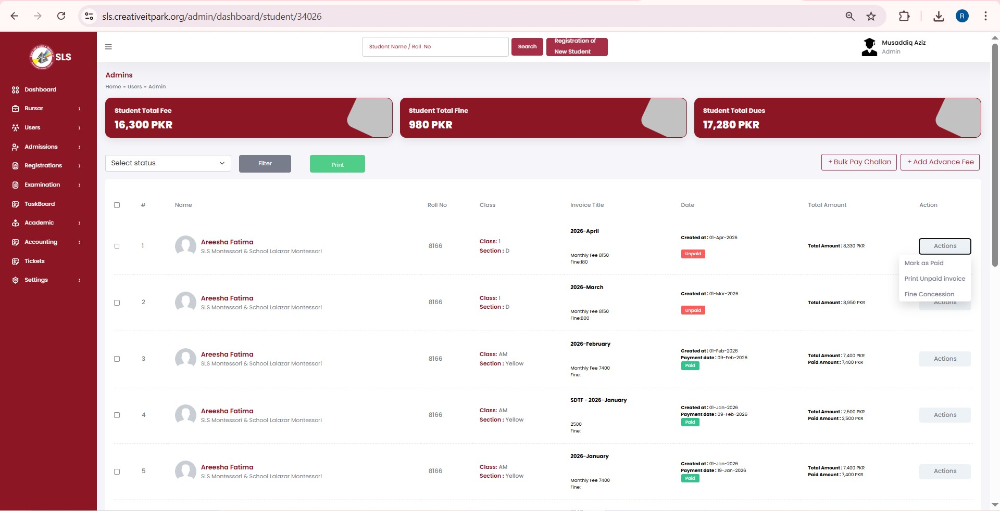

# SLS – School Management System

> **Production ERP built at Creative IT Park · Jan 2026 – Present**

SLS is a comprehensive, multi-tenant school ERP that serves as the central nervous system for the Creative IT Park school network. I engineered it from scratch — migrating from fragmented legacy systems into a unified platform managing the full lifecycle of 12,000+ students.

🔗 **Live platform:** [sls.creativeitpark.org](https://sls.creativeitpark.org)

---

## My Role

**Sole Backend Developer — architecture, development, server ops, and deployment**

I designed the system architecture, built all 8 role-based portals, owned the database schema, and managed every production deployment including Linux provisioning, SSL/DNS, and DB migrations.

---

## What It Does

- Full **student lifecycle management** — admission, profile, class assignment, progression
- **Fee & challan generation** with bulk print — automated monthly cycles for 12,000+ students
- **Attendance tracking** across all student and staff roles
- **Exam grading** with configurable marking schemes per class
- **Financial audit suite** — daily cash book, month-end reports, discount waivers, Excel/PDF exports
- **8 role-based portals** — Admin, Principal, Teacher, Student, Parent, Accountant, HR, and Auditor — each with granular RBAC permissions

---

## 📸 Screenshots

<table>
  <tr>
    <td></td>
    <td></td>
  </tr>
  <tr>
    <td></td>
    <td></td>
  </tr>
</table>

---

## Key Problems I Solved

### 🖨️ Bulk Challan Generation at Scale
Every month, 12,000+ individual fee challans need to be generated and printed. I engineered a PDF worker queue that handles the entire cycle in a single automated run — no manual intervention, no failures.

### 📊 Financial Audit Framework
Built a double-entry inspired auditing module that tracks tuition income, discount waivers, and cash collections with 100% precision — matching real-world cash books that accountants rely on daily. Eliminated human error in financial reporting entirely.

### 🔐 8-Portal RBAC Architecture
Designed a granular role-based access control system serving 8 distinct user types, each with completely different permission sets and UI surfaces — all on a single multi-tenant Laravel core.

### 🚀 Staging → Production Pipeline
Managed all server operations: Linux/cPanel provisioning, SSL/DNS, environment separation, DB migrations, and health checks — maintaining ≥99% uptime with rollback procedures in place.

---

## Results

- ✅ **60% reduction** in administrative labor — fee collection and grading fully automated
- ✅ **Zero human error** in financial reporting for 12,000+ students
- ✅ **≥99% uptime** maintained across all live portals
- ✅ Used daily by administrators, teachers, and accounting staff as the live operational system

---

## Tech Stack

| Layer | Technology |
|---|---|
| Framework | PHP · Laravel |
| Database | MySQL |
| Cache | Redis |
| Frontend | Bootstrap · Blade Templates |
| File Generation | PDF (Bulk Challan) · Excel (Reports) |
| Server | Linux · cPanel · Nginx |
| Deployment | Staging → Production · Zero-Downtime |

---

## Architecture Overview

```
8 Role-Based Portals (Admin / Teacher / Student / Parent / Accountant / HR / Principal / Auditor)
  │
  └── Laravel Core (Multi-tenant RBAC)
        ├── Student Lifecycle Module
        ├── Fee & Challan Engine ──── PDF Worker Queue (Bulk Print)
        ├── Attendance & Grading Module
        ├── Financial Audit Suite ─── Excel / PDF Export
        └── MySQL ─── Redis Cache
              │
              └── Linux / cPanel Production Server (≥99% Uptime)
```

---

## About This Repo

> The source code for SLS is proprietary and owned by Creative IT Park. This repository documents my contribution, architecture decisions, and problems solved — standard practice for professional portfolio showcases.

**Experience letter from Creative IT Park available on request.**

---

*Built by [Reyyan Alam](https://github.com/Reyyan31) · Backend Engineer · Node.js & APIs · Cloud & DevOps*
